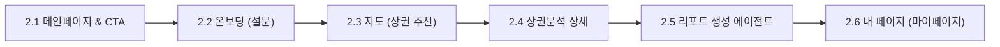
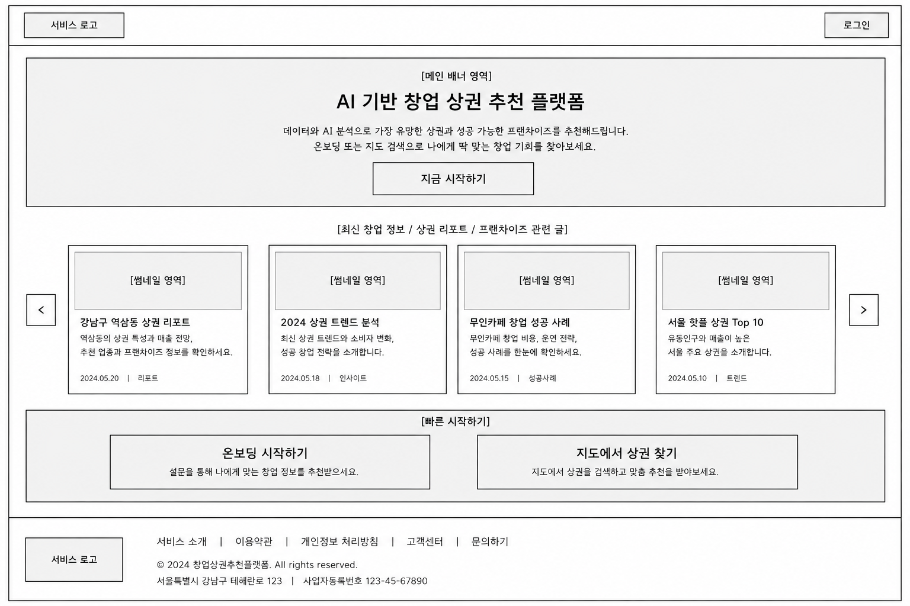
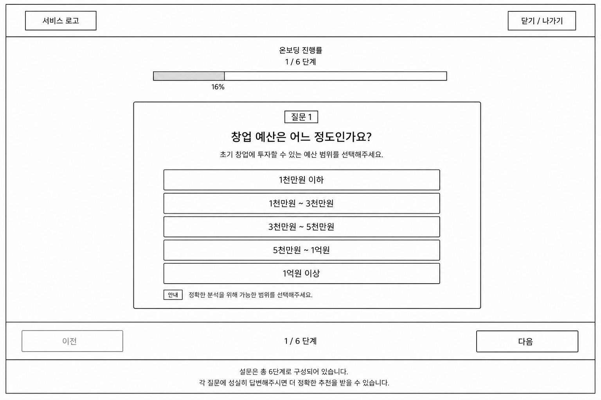
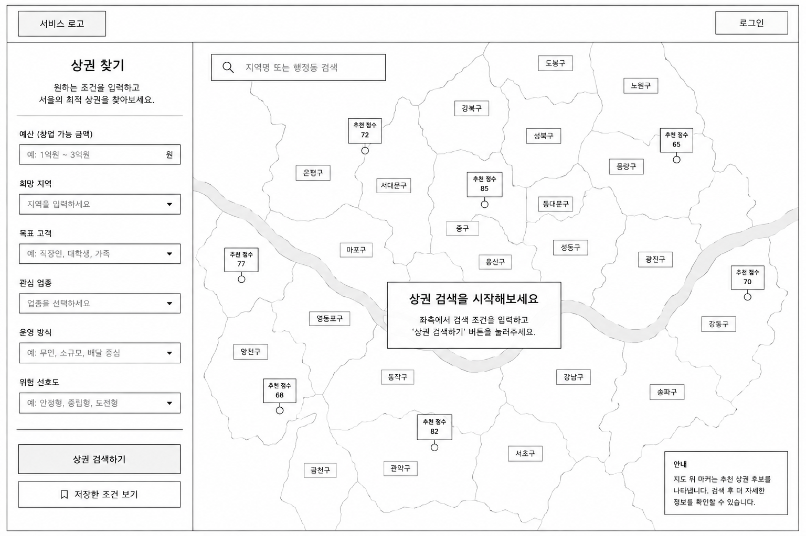
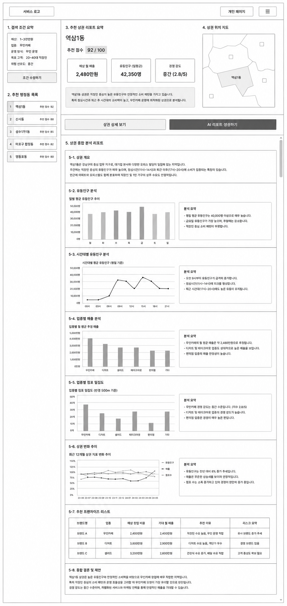
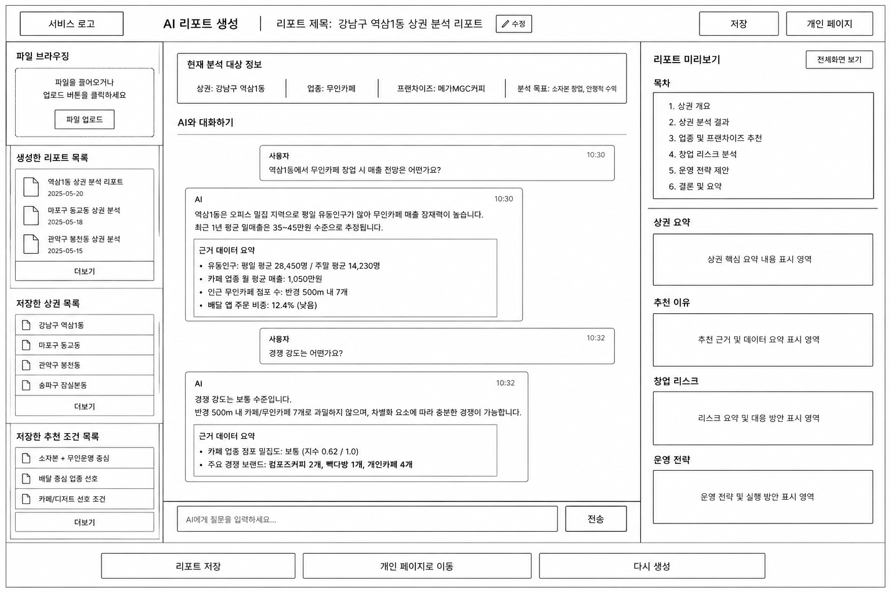
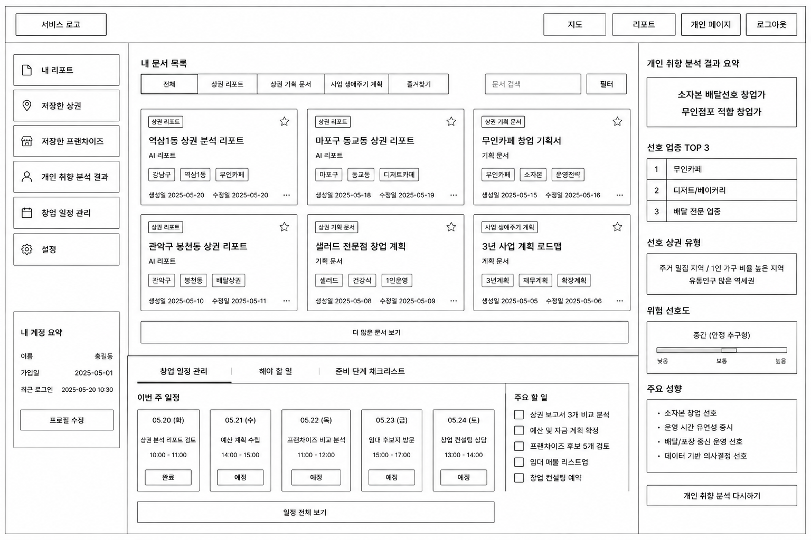

# 5. 와이어프레임 및 화면 명세

본 프로젝트 **"골목대장"**의 사용자 흐름을 시각화한 와이어프레임 및 프로토타입 설계안입니다. 

## 1. 전체 화면 구성 및 흐름

서비스는 사용자의 유입부터 개인화된 분석 보고서 관리까지 유기적인 흐름으로 구성되어 있습니다.

---

## 2. 화면별 상세 UI 및 데이터 명세

### 2.1 메인페이지 및 CTA (Main Page & CTA)
- **설명**: 서비스의 가치 제안과 핵심 기능을 소개하고, 사용자를 온보딩 설문이나 지도 탐색으로 빠르게 안내하는 랜딩 페이지입니다.
- **이미지**:
  

#### 📌 주요 UI 구성 요소 및 레이아웃
1. **상단 헤더 (GNB)**
   - 좌측: `서비스 로고` / 우측: `로그인` 버튼
2. **메인 배너 영역 (Hero Section)**
   - 타이틀: **AI 기반 창업 상권 추천 플랫폼**
   - 서브타이틀: "데이터와 AI 분석으로 가장 유망한 상권과 성공 가능한 프랜차이즈를 추천해 드립니다."
   - 버튼: `지금 시작하기` (클릭 시 온보딩 설문으로 이동)
3. **콘텐츠 영역 (최신 창업 정보 / 상권 리포트 / 프랜차이즈 인사이트)**
   - 썸네일 이미지 + 제목 + 요약 정보 + 등록일 + 카테고리 태그 구조의 카드형 UI 슬라이더 (좌/우 네비게이션 화살표 제공)
   - 예시 데이터:
     - 강남구 역삼동 상권 리포트 (2024.05.20 | 리포트)
     - 2024 상권 트렌드 분석 (2024.05.18 | 인사이트)
     - 무인카페 창업 성공 사례 (2024.05.15 | 성공사례)
     - 서울 핫플 상권 Top 10 (2024.05.10 | 트렌드)
4. **빠른 시작 영역 (Quick Action)**
   - `온보딩 시작하기`: 설문을 통해 나에게 맞는 창업 정보를 추천받는 메뉴
   - `지도에서 상권 찾기`: 지도에서 직접 검색하고 맞춤 추천을 받아보는 메뉴
5. **하단 푸터 (Footer)**
   - 회사 기본 정보, 서비스 소개, 이용약관, 개인정보처리방침 링크 및 카피라이트 표기

---

### 2.2 온보딩 (Onboarding)
- **설명**: 예비 창업자의 세부 조건을 수집하여 개인 맞춤형 상권/업종/브랜드를 분류하기 위한 6단계 대화식 설문 화면입니다.
- **이미지**:
  

#### 📌 주요 UI 구성 요소 및 레이아웃
1. **상단 상태 바**
   - 좌측: `서비스 로고` / 우측: `닫기 / 나가기` 버튼
   - 온보딩 진행률 표시: **"온보딩 진행률 1 / 6 단계 (16%)"** 수치 및 프로그레스 바 시각화
2. **설문 질문 카드 (중앙)**
   - 현재 단계 질문 번호: **질문 1**
   - 메인 질문: **"창업 예산은 어느 정도인가요?"**
   - 서브 안내: "초기 창업에 투자할 수 있는 예산 범위를 선택해주세요."
   - **라디오 선택지 항목**:
     - 1천만원 이하
     - 1천만원 ~ 3천만원
     - 3천만원 ~ 5천만원
     - 5천만원 ~ 1억원
     - 1억원 이상
   - 하단 툴팁: `안내` "정확한 분석을 위해 가능한 범위를 선택해주세요."
3. **하단 네비게이션 바**
   - 좌측: `이전` 버튼 (1단계에서는 비활성화)
   - 중앙: 현재 단계 인디케이터 (`1 / 6 단계`)
   - 우측: `다음` 버튼

---

### 2.3 지도 (Map - 상권 추천 및 탐색)
- **설명**: 서울시 지도를 기반으로 사용자 조건에 적합한 추천 점수가 마킹된 행정 구역을 탐색하고 조건을 세부 필터링할 수 있는 인터랙티브 지도 화면입니다.
- **이미지**:
  

#### 📌 주요 UI 구성 요소 및 레이아웃
1. **좌측 검색 필터 사이드바 (상권 찾기)**
   - **예산**: 창업 가능 금액 입력 필드 (예: "1억원 ~ 3억원")
   - **희망 지역**: 드롭다운 선택 필드
   - **목표 고객**: 드롭다운 선택 필드 (예: "직장인, 대학생, 가족")
   - **관심 업종**: 드롭다운 선택 필드
   - **운영 방식**: 드롭다운 선택 필드 (예: "무인, 소규모, 배달 중심")
   - **위험 선호도**: 드롭다운 선택 필드 (예: "안정형, 중립형, 도전형")
   - **실행 버튼**: `상권 검색하기` / `저장한 조건 보기`
2. **우측 지도 인터페이스 영역**
   - 상단 검색창: `지역명 또는 행정동 검색` 입력 필드
   - **서울 행정구역 공간 맵**: 은평구, 마포구, 용산구 등 각 지역 경계 시각화
   - **추천 점수 마커 핀**: 지도 위 적합한 추천 입지에 점수 핀 표시 (예: `추천 점수 72`, `추천 점수 85`, `추천 점수 77` 등)
   - 중앙 플로팅 팝업: `"상권 검색을 시작해보세요. 좌측에서 검색 조건을 입력하고 '상권 검색하기' 버튼을 눌러주세요."`
   - 우측 하단 안내창: `"지도 위 마커는 추천 상권 후보를 나타냅니다. 검색 후 더 자세한 정보를 확인할 수 있습니다."`

---

### 2.4 상권분석 상세 (Commercial Area Analysis Detail)
- **설명**: 선정된 행정동 상권의 정량 매출, 유동인구, 밀집도 데이터를 종합 시각화 대시보드로 분석하고 추천 프랜차이즈와 매치한 대시보드 화면입니다.
- **이미지**:
  

#### 📌 주요 UI 구성 요소 및 레이아웃
1. **좌측 요약 사이드바**
   - **검색 조건 요약**: 예산, 업종(무인카페), 운영방식(무인 운영), 목표 고객(20~40대 직장인), 위험 선호도(중간) 정보 표시 및 `조건 수정하기` 버튼
   - **추천 행정동 목록**: 추천 점수 순위 리스트 제공 (1. 역삼1동 92점, 2. 신사동 88점, 3. 성수1가1동 85점, 4. 마포구 합정동 82점, 5. 영등포동 80점)
2. **우측 상세 분석 대시보드 (메인)**
   - **추천 상권 리포트 요약 (역삼1동)**
     - 추천 점수: **92 / 100**
     - 핵심 지표 카드 3종: `예상 월 매출 (2,480만원)`, `유동인구 일평균 (42,350명)`, `경쟁 강도 (중간 2.8/5)`
     - 핵심 분석 한줄 요약 텍스트 영역
     - 액션 버튼: `상권 상세 보기`, `AI 리포트 생성하기`
   - **상권 위치 지도**: 해당 행정동 경계 미니맵 영역
   - **상권 종합 분석 리포트 (차트 및 데이터 시각화)**
     - **5-1. 상권 개요**: 타겟 지역의 특징 및 주 소비층 요약 텍스트
     - **5-2. 유동인구 분석**: 일별 평균 유동인구 추이 (막대그래프) + 분석 요약 정보
     - **5-3. 시간대별 유동인구 분석**: 24시간대별 평균 유동인구 (꺾은선그래프) + 분석 요약 정보
     - **5-4. 업종별 매출 분석**: 무인카페, 디저트, 샐러드 등 업종별 매출 (막대그래프) + 분석 요약 정보
     - **5-5. 업종별 점포 밀집도**: 경쟁 점포 수 밀집 현황 (막대그래프) + 분석 요약 정보
     - **5-6. 상권 변화 추이**: 유동인구/매출/점포수 12개월 추이 (다중 꺾은선그래프) + 분석 요약 정보
     - **5-7. 추천 프랜차이즈 리스트**: 브랜드명, 업종, 창업 비용, 기대 매출, 추천 이유, 리스크 요약을 비교한 테이블 표 (예: 브랜드 A - 무인카페 - 2,400만원 창업비 - 2,400만원 기대매출 등)
     - **5-8. 종합 결론 및 제안**: 최종 가이던스 리포트 텍스트

---

### 2.5 리포트 생성 에이전트 (Report Generation Agent)
- **설명**: RAG 검색 시스템과 LLM 에이전트가 연동되어 실시간 대화식으로 상권 분석 정보에 질의응답을 수행하며 리포트 문서를 완성하고 미리보는 협업 환경 화면입니다.
- **이미지**:
  

#### 📌 주요 UI 구성 요소 및 레이아웃
1. **최상단 타이틀 영역**
   - `서비스 로고`
   - 현재 리포트 제목: **리포트 제목: 강남구 역삼1동 상권 분석 리포트** (`수정` 버튼 제공)
   - 우측 액션: `저장`, `개인 페이지` 버튼
2. **좌측 파일 및 리스트 탐색기 (사이드바)**
   - **파일 브라우징**: 문서 및 데이터 파일을 드래그하거나 선택하여 로드할 수 있는 업로드 컴포넌트
   - **생성한 리포트 목록**: 과거 작성 리포트 아카이브 리스트
   - **저장한 상권 목록**: 관심 상권 바로가기 (역삼1동, 동교동, 봉천동, 잠실본동 등)
   - **저장한 추천 조건 목록**: 분석 조건 프리셋 리스트
3. **중앙 AI 대화 및 에이전트 제어창**
   - 상단 탭: 분석 중인 현재 대상 정보 요약 (상권: 역삼1동, 업종: 무인카페, 브랜드: 메가MGC커피 등)
   - **대화 내역 (Chat History)**:
     - 사용자 질문 풍선 및 AI 답변 풍선 구조
     - AI 응답 내부에는 답변 도출의 근거가 된 데이터 요약 박스(`근거 데이터 요약` - 예: 유동인구 데이터, 점포 밀집도, 인근 경쟁 브랜드 현황 등)가 임베딩되어 투명하게 표시됨
   - 하단 입력부: `AI에게 질문을 입력하세요...` 텍스트 필드와 `전송` 버튼
4. **우측 리포트 미리보기 (웹/PDF 뷰어)**
   - 상단: `전체화면 보기` 버튼
   - **목차 앵커 내비게이터**: (1. 상권 개요, 2. 분석 결과, 3. 업종 및 추천, 4. 리스크 분석, 5. 운영 전략, 6. 결론)
   - 실시간 연동 리포트 본문 카드 영역 (상권 요약 내용, 추천 근거 데이터, 리스크 대응 방안, 운영 전략 표기)
5. **최하단 통합 네비게이션**
   - `리포트 저장` / `개인 페이지로 이동` / `다시 생성` 버튼

---

### 2.6 내 페이지 (My Page / 마이페이지)
- **설명**: 로그인한 사용자가 자신의 개인 계정 프로필, 선호 취향 분석 내용, 저장한 문서 및 주간 창업 스케줄링 태스크를 한눈에 모니터링하는 대시보드입니다.
- **이미지**:
  

#### 📌 주요 UI 구성 요소 및 레이아웃
1. **좌측 개인 프로필 및 메뉴 바**
   - 메뉴 탭: `내 리포트`, `저장한 상권`, `저장한 프랜차이즈`, `개인 취향 분석 결과`, `창업 일정 관리`, `설정`
   - **내 계정 요약**: 사용자 프로필 이미지, 이름 (예: **홍길동**), 가입일(2025-05-01), 최근 로그인 일시 및 `프로필 수정` 버튼
2. **중앙 대시보드 메인 영역**
   - **내 문서 목록 (탭 필터 제공: 전체 / 상권 리포트 / 상권 기획 문서 / 사업 생애주기 계획 / 즐겨찾기)**
     - 카드형 리스트 구성: 각 카드는 문서 종류 태그, 문서 제목, 요약 키워드 태그, 생성일/수정일, 즐겨찾기 별표 버튼, 추가 메뉴 버튼을 포함
     - 카드 데이터 예시: 역삼1동 상권 분석 리포트, 무인카페 창업 기획서, 3년 사업 계획 로드맵 등
     - 하단: `더 많은 문서 보기` 버튼
   - **일정 및 체크리스트 영역 (하단)**
     - **창업 일정 관리**: 주간 요일별 캘린더 피드 (예: 05.20 화 상권 분석 리포트 검토 [완료], 05.21 수 예산 계획 수립 [예정] 등)
     - **해야 할 일 / 준비 단계 체크리스트**: 체크박스 리스트 형태의 태스크 관리 영역 (예: 상권 보고서 3개 비교 분석, 예산 및 자금 계획 확정 등)
3. **우측 개인 취향 및 선호 분석 사이드바**
   - **개인 취향 분석 결과 요약**: 사용자 맞춤 페르소나 키워드 라벨 (예: `"소자본 배달선호 창업가"`, `"무인점포 적합 창업가"`)
   - **선호 업종 TOP 3**: 1위 무인카페, 2위 디저트/베이커리, 3위 배달 전문 업종
   - **선호 상권 유형**: 주거 밀집 지역, 1인 가구 비율 높은 지역 등 텍스트 배지
   - **위험 선호도**: 안정형-보통-도전형 중 위치를 나타내는 슬라이더 인디케이터 (예: `중간 (안정 추구형)`)
   - **주요 성향 분석**: 불릿 리스트 요약
   - 하단 버튼: `개인 취향 분석 다시하기`
