# 7 ERD
현재의 ERD는 프로젝트 요구사항에 맞춘 정규화된 ERD이며,
공공데이터 양식에 맞추어 칼럼을 추가/수정할 수 있다.

## 0. 공통 Base / Enum

```java
@MappedSuperclass
@Getter
@Setter
public abstract class BaseEntity {
    @Id
    @GeneratedValue(strategy = GenerationType.IDENTITY)
    private Long id;

    private LocalDateTime createdAt;
    private LocalDateTime updatedAt;

    @PrePersist
    void prePersist() {
        this.createdAt = LocalDateTime.now();
        this.updatedAt = LocalDateTime.now();
    }

    @PreUpdate
    void preUpdate() {
        this.updatedAt = LocalDateTime.now();
    }
}
```

```java
public enum OAuthProvider {
    GOOGLE, KAKAO, NAVER
}

public enum UserRole {
    USER, ADMIN
}

public enum Gender {
    MALE, FEMALE, UNKNOWN
}

public enum AgeGroup {
    AGE_10, AGE_20, AGE_30, AGE_40, AGE_50, AGE_60_PLUS, UNKNOWN
}

public enum DayType {
    WEEKDAY, WEEKEND, ALL
}

public enum TimeSlot {
    DAWN, MORNING, LUNCH, AFTERNOON, EVENING, NIGHT, ALL
}

public enum MetricType {
    ESTIMATED_SALES,
    CONSUMPTION_RATIO,
    RESIDENT_POPULATION,
    LIVING_POPULATION,
    WORKING_POPULATION,
    FLOATING_POPULATION,
    STORE_COUNT,
    FRANCHISE_STORE_COUNT,
    OPEN_COUNT,
    CLOSE_COUNT,
    SURVIVAL_MONTHS,
    RENT,
    VACANCY_RATE,
    COMMERCIAL_REAL_ESTATE_PRICE,
    APARTMENT_HOUSEHOLD_COUNT,
    FACILITY_COUNT
}

public enum DocumentType {
    COMMERCIAL_REPORT,
    BUSINESS_PLAN,
    STARTUP_LIFECYCLE_PLAN,
    MEMO
}

public enum ReportStatus {
    PENDING, RUNNING, COMPLETED, FAILED
}

public enum MessageRole {
    USER, ASSISTANT, SYSTEM, TOOL
}

public enum ToolCallStatus {
    REQUESTED, APPROVED, REJECTED, SUCCESS, FAILED
}
```

---

## 1. 사용자 / 인증 / 온보딩

```java
@Entity
@Table(name = "users")
@Getter
@Setter
public class User extends BaseEntity {

    @Column(nullable = false, unique = true)
    private String email;

    private String nickname;

    @Enumerated(EnumType.STRING)
    private UserRole role = UserRole.USER;

    private Boolean active = true;
}
```

```java
@Entity
@Table(name = "oauth_accounts")
@Getter
@Setter
public class OAuthAccount extends BaseEntity {

    @ManyToOne(fetch = FetchType.LAZY)
    @JoinColumn(name = "user_id")
    private User user;

    @Enumerated(EnumType.STRING)
    private OAuthProvider provider;

    @Column(nullable = false)
    private String providerUserId;

    private String providerEmail;
}
```

```java
@Entity
@Table(name = "user_profiles")
@Getter
@Setter
public class UserProfile extends BaseEntity {

    @OneToOne(fetch = FetchType.LAZY)
    @JoinColumn(name = "user_id", unique = true)
    private User user;

    private Integer birthYear;

    @Enumerated(EnumType.STRING)
    private Gender gender;

    private String occupation;

    private Integer startupBudget;

    private String preferredRegion;

    private String preferredOperationType;

    private String riskPreference;

    private String personaLabel;
}
```

```java
@Entity
@Table(name = "onboarding_sessions")
@Getter
@Setter
public class OnboardingSession extends BaseEntity {

    @ManyToOne(fetch = FetchType.LAZY)
    @JoinColumn(name = "user_id")
    private User user;

    private Boolean completed = false;

    private LocalDateTime completedAt;
}
```

```java
@Entity
@Table(name = "onboarding_questions")
@Getter
@Setter
public class OnboardingQuestion extends BaseEntity {

    @Column(nullable = false)
    private String questionKey;

    @Column(nullable = false)
    private String questionText;

    private Integer displayOrder;

    private Boolean active = true;
}
```

```java
@Entity
@Table(name = "onboarding_answers")
@Getter
@Setter
public class OnboardingAnswer extends BaseEntity {

    @ManyToOne(fetch = FetchType.LAZY)
    @JoinColumn(name = "session_id")
    private OnboardingSession session;

    @ManyToOne(fetch = FetchType.LAZY)
    @JoinColumn(name = "question_id")
    private OnboardingQuestion question;

    @Column(columnDefinition = "text")
    private String answerText;

    @Column(columnDefinition = "jsonb")
    private String answerJson;
}
```

---

## 2. 행정동 / 상권 / 데이터 출처

```java
@Entity
@Table(name = "admin_dongs")
@Getter
@Setter
public class AdminDong extends BaseEntity {

    @Column(nullable = false)
    private String sido;

    @Column(nullable = false)
    private String sigungu;

    @Column(nullable = false)
    private String dongName;

    @Column(nullable = false, unique = true)
    private String adminDongCode;

    @Column(columnDefinition = "geometry(MultiPolygon,4326)")
    private Geometry boundary;

    @Column(columnDefinition = "geometry(Point,4326)")
    private Point centerPoint;
}
```

```java
@Entity
@Table(name = "data_sources")
@Getter
@Setter
public class DataSource extends BaseEntity {

    @Column(nullable = false)
    private String name;

    private String provider;

    private String sourceUrl;

    private LocalDate collectedDate;

    private LocalDate baseDate;

    @Column(columnDefinition = "text")
    private String description;
}
```

```java
@Entity
@Table(name = "metric_periods")
@Getter
@Setter
public class MetricPeriod extends BaseEntity {

    private Integer year;

    private Integer quarter;

    private Integer month;

    private LocalDate startDate;

    private LocalDate endDate;
}
```

```java
@Entity
@Table(name = "industries")
@Getter
@Setter
public class Industry extends BaseEntity {

    @Column(nullable = false)
    private String name;

    private String industryCode;

    private String parentCategory;

    @Column(columnDefinition = "text")
    private String description;
}
```

```java
@Entity
@Table(name = "commercial_metrics")
@Getter
@Setter
public class CommercialMetric extends BaseEntity {

    @ManyToOne(fetch = FetchType.LAZY)
    @JoinColumn(name = "admin_dong_id")
    private AdminDong adminDong;

    @ManyToOne(fetch = FetchType.LAZY)
    @JoinColumn(name = "industry_id")
    private Industry industry;

    @ManyToOne(fetch = FetchType.LAZY)
    @JoinColumn(name = "period_id")
    private MetricPeriod period;

    @ManyToOne(fetch = FetchType.LAZY)
    @JoinColumn(name = "data_source_id")
    private DataSource dataSource;

    @Enumerated(EnumType.STRING)
    private MetricType metricType;

    @Enumerated(EnumType.STRING)
    private Gender gender;

    @Enumerated(EnumType.STRING)
    private AgeGroup ageGroup;

    @Enumerated(EnumType.STRING)
    private DayType dayType;

    @Enumerated(EnumType.STRING)
    private TimeSlot timeSlot;

    private BigDecimal value;

    private String unit;
}
```

```java
@Entity
@Table(name = "facilities")
@Getter
@Setter
public class Facility extends BaseEntity {

    @ManyToOne(fetch = FetchType.LAZY)
    @JoinColumn(name = "admin_dong_id")
    private AdminDong adminDong;

    private String facilityType;

    private String facilityName;

    @Column(columnDefinition = "geometry(Point,4326)")
    private Point location;
}
```

```java
@Entity
@Table(name = "stores")
@Getter
@Setter
public class Store extends BaseEntity {

    @ManyToOne(fetch = FetchType.LAZY)
    @JoinColumn(name = "admin_dong_id")
    private AdminDong adminDong;

    @ManyToOne(fetch = FetchType.LAZY)
    @JoinColumn(name = "industry_id")
    private Industry industry;

    private String storeName;

    private Boolean franchiseStore;

    @Column(columnDefinition = "geometry(Point,4326)")
    private Point location;
}
```

---

## 3. 프랜차이즈

```java
@Entity
@Table(name = "franchise_brands")
@Getter
@Setter
public class FranchiseBrand extends BaseEntity {

    @Column(nullable = false)
    private String brandName;

    private String companyName;

    @ManyToOne(fetch = FetchType.LAZY)
    @JoinColumn(name = "industry_id")
    private Industry industry;

    @Column(columnDefinition = "text")
    private String description;

    private String operationType;

    private Boolean active = true;
}
```

```java
@Entity
@Table(name = "franchise_startup_costs")
@Getter
@Setter
public class FranchiseStartupCost extends BaseEntity {

    @ManyToOne(fetch = FetchType.LAZY)
    @JoinColumn(name = "brand_id")
    private FranchiseBrand brand;

    private BigDecimal franchiseFee;

    private BigDecimal educationFee;

    private BigDecimal deposit;

    private BigDecimal interiorCost;

    private BigDecimal otherCost;

    private BigDecimal totalCost;

    private String costUnit;
}
```

```java
@Entity
@Table(name = "franchise_sales_stats")
@Getter
@Setter
public class FranchiseSalesStat extends BaseEntity {

    @ManyToOne(fetch = FetchType.LAZY)
    @JoinColumn(name = "brand_id")
    private FranchiseBrand brand;

    @ManyToOne(fetch = FetchType.LAZY)
    @JoinColumn(name = "period_id")
    private MetricPeriod period;

    private BigDecimal averageSales;

    private BigDecimal salesPerArea;

    private Integer storeCount;

    private String regionName;
}
```

```java
@Entity
@Table(name = "franchise_disclosures")
@Getter
@Setter
public class FranchiseDisclosure extends BaseEntity {

    @ManyToOne(fetch = FetchType.LAZY)
    @JoinColumn(name = "brand_id")
    private FranchiseBrand brand;

    private String disclosureNumber;

    private LocalDate registeredDate;

    private String disclosureUrl;

    @ManyToOne(fetch = FetchType.LAZY)
    @JoinColumn(name = "data_source_id")
    private DataSource dataSource;
}
```

```java
@Entity
@Table(name = "franchise_posts")
@Getter
@Setter
public class FranchisePost extends BaseEntity {

    @ManyToOne(fetch = FetchType.LAZY)
    @JoinColumn(name = "brand_id")
    private FranchiseBrand brand;

    private String title;

    @Column(columnDefinition = "text")
    private String content;

    private String thumbnailUrl;

    private Boolean published = true;
}
```

---

## 4. 추천 / 점수 산정

```java
@Entity
@Table(name = "recommendation_requests")
@Getter
@Setter
public class RecommendationRequest extends BaseEntity {

    @ManyToOne(fetch = FetchType.LAZY)
    @JoinColumn(name = "user_id")
    private User user;

    private Integer budget;

    private String targetRegion;

    private String targetCustomer;

    private String preferredIndustry;

    private String operationType;

    private String riskPreference;

    @Column(columnDefinition = "jsonb")
    private String rawConditionJson;
}
```

```java
@Entity
@Table(name = "recommendation_results")
@Getter
@Setter
public class RecommendationResult extends BaseEntity {

    @ManyToOne(fetch = FetchType.LAZY)
    @JoinColumn(name = "request_id")
    private RecommendationRequest request;

    @ManyToOne(fetch = FetchType.LAZY)
    @JoinColumn(name = "admin_dong_id")
    private AdminDong adminDong;

    @ManyToOne(fetch = FetchType.LAZY)
    @JoinColumn(name = "industry_id")
    private Industry industry;

    @ManyToOne(fetch = FetchType.LAZY)
    @JoinColumn(name = "brand_id")
    private FranchiseBrand brand;

    private Integer rankOrder;

    private BigDecimal totalScore;

    @Column(columnDefinition = "text")
    private String summaryReason;

    @Column(columnDefinition = "text")
    private String riskSummary;
}
```

```java
@Entity
@Table(name = "recommendation_score_items")
@Getter
@Setter
public class RecommendationScoreItem extends BaseEntity {

    @ManyToOne(fetch = FetchType.LAZY)
    @JoinColumn(name = "result_id")
    private RecommendationResult result;

    private String scoreType;

    private BigDecimal score;

    private BigDecimal weight;

    @Column(columnDefinition = "text")
    private String evidenceText;
}
```

```java
@Entity
@Table(name = "industry_fit_scores")
@Getter
@Setter
public class IndustryFitScore extends BaseEntity {

    @ManyToOne(fetch = FetchType.LAZY)
    @JoinColumn(name = "admin_dong_id")
    private AdminDong adminDong;

    @ManyToOne(fetch = FetchType.LAZY)
    @JoinColumn(name = "industry_id")
    private Industry industry;

    @ManyToOne(fetch = FetchType.LAZY)
    @JoinColumn(name = "period_id")
    private MetricPeriod period;

    private BigDecimal demandScore;

    private BigDecimal targetCustomerScore;

    private BigDecimal timeSlotScore;

    private BigDecimal competitionScore;

    private BigDecimal costScore;

    private BigDecimal sustainabilityScore;

    private BigDecimal totalScore;
}
```

```java
@Entity
@Table(name = "industry_weight_configs")
@Getter
@Setter
public class IndustryWeightConfig extends BaseEntity {

    @ManyToOne(fetch = FetchType.LAZY)
    @JoinColumn(name = "industry_id")
    private Industry industry;

    private BigDecimal demandWeight;

    private BigDecimal targetCustomerWeight;

    private BigDecimal timeSlotWeight;

    private BigDecimal competitionWeight;

    private BigDecimal costWeight;

    private BigDecimal sustainabilityWeight;

    private Boolean active = true;
}
```

```java
@Entity
@Table(name = "saved_recommendations")
@Getter
@Setter
public class SavedRecommendation extends BaseEntity {

    @ManyToOne(fetch = FetchType.LAZY)
    @JoinColumn(name = "user_id")
    private User user;

    @ManyToOne(fetch = FetchType.LAZY)
    @JoinColumn(name = "recommendation_result_id")
    private RecommendationResult recommendationResult;

    private String memo;
}
```

---

## 5. 사용자 저장 / 관심 항목

```java
@Entity
@Table(name = "saved_admin_dongs")
@Getter
@Setter
public class SavedAdminDong extends BaseEntity {

    @ManyToOne(fetch = FetchType.LAZY)
    @JoinColumn(name = "user_id")
    private User user;

    @ManyToOne(fetch = FetchType.LAZY)
    @JoinColumn(name = "admin_dong_id")
    private AdminDong adminDong;

    private String memo;
}
```

```java
@Entity
@Table(name = "saved_franchise_brands")
@Getter
@Setter
public class SavedFranchiseBrand extends BaseEntity {

    @ManyToOne(fetch = FetchType.LAZY)
    @JoinColumn(name = "user_id")
    private User user;

    @ManyToOne(fetch = FetchType.LAZY)
    @JoinColumn(name = "brand_id")
    private FranchiseBrand brand;

    private String memo;
}
```

```java
@Entity
@Table(name = "user_preference_vectors")
@Getter
@Setter
public class UserPreferenceVector extends BaseEntity {

    @OneToOne(fetch = FetchType.LAZY)
    @JoinColumn(name = "user_id", unique = true)
    private User user;

    @Column(columnDefinition = "vector(1536)")
    private String embedding;

    private String modelName;

    private LocalDateTime lastUpdatedAt;
}
```

```java
@Entity
@Table(name = "user_preference_tags")
@Getter
@Setter
public class UserPreferenceTag extends BaseEntity {

    @ManyToOne(fetch = FetchType.LAZY)
    @JoinColumn(name = "user_id")
    private User user;

    private String tagName;

    private BigDecimal weight;
}
```

---

## 6. AI / RAG / 채팅

```java
@Entity
@Table(name = "rag_documents")
@Getter
@Setter
public class RagDocument extends BaseEntity {

    private String title;

    private String documentType;

    private String sourceUrl;

    @ManyToOne(fetch = FetchType.LAZY)
    @JoinColumn(name = "data_source_id")
    private DataSource dataSource;

    @Column(columnDefinition = "text")
    private String content;
}
```

```java
@Entity
@Table(name = "rag_chunks")
@Getter
@Setter
public class RagChunk extends BaseEntity {

    @ManyToOne(fetch = FetchType.LAZY)
    @JoinColumn(name = "document_id")
    private RagDocument document;

    private Integer chunkIndex;

    @Column(columnDefinition = "text")
    private String chunkText;

    @Column(columnDefinition = "vector(1536)")
    private String embedding;

    @ManyToOne(fetch = FetchType.LAZY)
    @JoinColumn(name = "admin_dong_id")
    private AdminDong adminDong;

    @ManyToOne(fetch = FetchType.LAZY)
    @JoinColumn(name = "industry_id")
    private Industry industry;

    @ManyToOne(fetch = FetchType.LAZY)
    @JoinColumn(name = "brand_id")
    private FranchiseBrand brand;
}
```

```java
@Entity
@Table(name = "chat_sessions")
@Getter
@Setter
public class ChatSession extends BaseEntity {

    @ManyToOne(fetch = FetchType.LAZY)
    @JoinColumn(name = "user_id")
    private User user;

    private String title;

    @ManyToOne(fetch = FetchType.LAZY)
    @JoinColumn(name = "admin_dong_id")
    private AdminDong adminDong;

    @ManyToOne(fetch = FetchType.LAZY)
    @JoinColumn(name = "industry_id")
    private Industry industry;

    @ManyToOne(fetch = FetchType.LAZY)
    @JoinColumn(name = "brand_id")
    private FranchiseBrand brand;
}
```

```java
@Entity
@Table(name = "chat_messages")
@Getter
@Setter
public class ChatMessage extends BaseEntity {

    @ManyToOne(fetch = FetchType.LAZY)
    @JoinColumn(name = "session_id")
    private ChatSession session;

    @Enumerated(EnumType.STRING)
    private MessageRole role;

    @Column(columnDefinition = "text")
    private String content;

    @Column(columnDefinition = "jsonb")
    private String metadataJson;
}
```

```java
@Entity
@Table(name = "agent_runs")
@Getter
@Setter
public class AgentRun extends BaseEntity {

    @ManyToOne(fetch = FetchType.LAZY)
    @JoinColumn(name = "session_id")
    private ChatSession session;

    private String runId;

    private String status;

    private LocalDateTime startedAt;

    private LocalDateTime endedAt;
}
```

```java
@Entity
@Table(name = "agent_tool_calls")
@Getter
@Setter
public class AgentToolCall extends BaseEntity {

    @ManyToOne(fetch = FetchType.LAZY)
    @JoinColumn(name = "agent_run_id")
    private AgentRun agentRun;

    private String toolName;

    @Enumerated(EnumType.STRING)
    private ToolCallStatus status;

    @Column(columnDefinition = "jsonb")
    private String requestJson;

    @Column(columnDefinition = "jsonb")
    private String responseJson;

    private Boolean hitlRequired;
}
```

```java
@Entity
@Table(name = "agent_eval_results")
@Getter
@Setter
public class AgentEvalResult extends BaseEntity {

    private String scenarioName;

    private String targetTask;

    private Boolean passed;

    private BigDecimal score;

    @Column(columnDefinition = "text")
    private String failureReason;

    @Column(columnDefinition = "jsonb")
    private String detailJson;
}
```

---

## 7. 리포트 / 문서 / 개인 페이지

```java
@Entity
@Table(name = "reports")
@Getter
@Setter
public class Report extends BaseEntity {

    @ManyToOne(fetch = FetchType.LAZY)
    @JoinColumn(name = "user_id")
    private User user;

    @ManyToOne(fetch = FetchType.LAZY)
    @JoinColumn(name = "recommendation_result_id")
    private RecommendationResult recommendationResult;

    @ManyToOne(fetch = FetchType.LAZY)
    @JoinColumn(name = "chat_session_id")
    private ChatSession chatSession;

    private String title;

    @Enumerated(EnumType.STRING)
    private ReportStatus status;

    @Column(columnDefinition = "text")
    private String summary;

    private String fileUrl;
}
```

```java
@Entity
@Table(name = "documents")
@Getter
@Setter
public class Document extends BaseEntity {

    @ManyToOne(fetch = FetchType.LAZY)
    @JoinColumn(name = "user_id")
    private User user;

    @Enumerated(EnumType.STRING)
    private DocumentType documentType;

    private String title;

    @Column(columnDefinition = "text")
    private String content;

    private String fileUrl;
}
```

```java
@Entity
@Table(name = "document_tags")
@Getter
@Setter
public class DocumentTag extends BaseEntity {

    @ManyToOne(fetch = FetchType.LAZY)
    @JoinColumn(name = "document_id")
    private Document document;

    private String tagName;
}
```

```java
@Entity
@Table(name = "startup_schedule_items")
@Getter
@Setter
public class StartupScheduleItem extends BaseEntity {

    @ManyToOne(fetch = FetchType.LAZY)
    @JoinColumn(name = "user_id")
    private User user;

    private String title;

    @Column(columnDefinition = "text")
    private String description;

    private LocalDate dueDate;

    private Boolean completed = false;

    private String category;
}
```

---

## 8. Mermaid ERD 초안

```mermaid
erDiagram
    USER ||--o{ OAUTH_ACCOUNT : has
    USER ||--|| USER_PROFILE : has
    USER ||--o{ ONBOARDING_SESSION : completes
    ONBOARDING_SESSION ||--o{ ONBOARDING_ANSWER : contains
    ONBOARDING_QUESTION ||--o{ ONBOARDING_ANSWER : answered_by

    ADMIN_DONG ||--o{ COMMERCIAL_METRIC : has
    INDUSTRY ||--o{ COMMERCIAL_METRIC : measured_by
    METRIC_PERIOD ||--o{ COMMERCIAL_METRIC : groups
    DATA_SOURCE ||--o{ COMMERCIAL_METRIC : provides

    ADMIN_DONG ||--o{ FACILITY : contains
    ADMIN_DONG ||--o{ STORE : contains
    INDUSTRY ||--o{ STORE : classifies

    INDUSTRY ||--o{ FRANCHISE_BRAND : includes
    FRANCHISE_BRAND ||--o{ FRANCHISE_STARTUP_COST : has
    FRANCHISE_BRAND ||--o{ FRANCHISE_SALES_STAT : has
    FRANCHISE_BRAND ||--o{ FRANCHISE_DISCLOSURE : has
    FRANCHISE_BRAND ||--o{ FRANCHISE_POST : has

    USER ||--o{ RECOMMENDATION_REQUEST : creates
    RECOMMENDATION_REQUEST ||--o{ RECOMMENDATION_RESULT : returns
    ADMIN_DONG ||--o{ RECOMMENDATION_RESULT : recommended_as
    INDUSTRY ||--o{ RECOMMENDATION_RESULT : recommended_as
    FRANCHISE_BRAND ||--o{ RECOMMENDATION_RESULT : recommended_as
    RECOMMENDATION_RESULT ||--o{ RECOMMENDATION_SCORE_ITEM : explains

    ADMIN_DONG ||--o{ INDUSTRY_FIT_SCORE : scored
    INDUSTRY ||--o{ INDUSTRY_FIT_SCORE : scored
    INDUSTRY ||--o{ INDUSTRY_WEIGHT_CONFIG : configures

    USER ||--o{ SAVED_RECOMMENDATION : saves
    USER ||--o{ SAVED_ADMIN_DONG : saves
    USER ||--o{ SAVED_FRANCHISE_BRAND : saves
    USER ||--|| USER_PREFERENCE_VECTOR : has
    USER ||--o{ USER_PREFERENCE_TAG : has

    DATA_SOURCE ||--o{ RAG_DOCUMENT : provides
    RAG_DOCUMENT ||--o{ RAG_CHUNK : split_into
    ADMIN_DONG ||--o{ RAG_CHUNK : tags
    INDUSTRY ||--o{ RAG_CHUNK : tags
    FRANCHISE_BRAND ||--o{ RAG_CHUNK : tags

    USER ||--o{ CHAT_SESSION : starts
    CHAT_SESSION ||--o{ CHAT_MESSAGE : contains
    CHAT_SESSION ||--o{ AGENT_RUN : executes
    AGENT_RUN ||--o{ AGENT_TOOL_CALL : calls

    USER ||--o{ REPORT : creates
    RECOMMENDATION_RESULT ||--o{ REPORT : basis
    CHAT_SESSION ||--o{ REPORT : basis

    USER ||--o{ DOCUMENT : owns
    DOCUMENT ||--o{ DOCUMENT_TAG : has
    USER ||--o{ STARTUP_SCHEDULE_ITEM : manages
```


