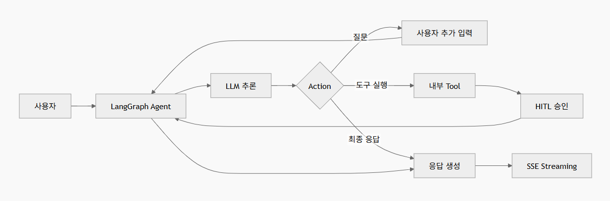

# AI 에이전트 설계

## 에이전트 아키텍처 흐름도

## 기본 로직

* AI 에이전트는 LangGraph 기반의 StateGraph로 구성한다.
* 기본 동작은 Chat Model 호출 → ToolCalls 확인 → 도구 실행 또는 최종 응답 생성 흐름이다.
* AI 응답에 ToolCalls가 존재하면 Tool Call Loop를 통해 필요한 도구를 실행한다.
* ToolCalls가 비어 있으면 추가 도구 실행 없이 최종 응답을 생성한다.
* 도구 호출 전 사용자 권한과 정책을 확인하고, 승인이 필요한 경우 실행을 인터럽트한다.
* 인터럽트된 승인 요청은 LangGraph React를 통해 클라이언트 화면에 표시한다.
* 사용자가 승인 또는 거절하면 `stream.respond`를 통해 에이전트 실행을 재개한다.
* AI가 사용자에게 추가 질문이 필요하다고 판단한 경우에도 인터럽트를 발생시켜 사용자 응답을 받는다.
* POC에서는 Tool Call Loop, HITL 승인, 사용자 질문 인터럽트, SSE 스트리밍 응답이 정상 동작하는지 검증한다.
* Evals는 도구 호출 성공률, 인터럽트 처리, 최종 응답 생성 여부를 기준으로 수행한다.
* MCP, skills 등은 문서를 Tools 형태로 변환하는 어댑터로 적용하고, 외부 서버는 REST로 호출한다.

## POC
* 클라이언트 요청에 따라 Annotation State 적용 확인
* 휴먼인더루프 사용자 허용 UI 확인완료
* 도구 연속 호출 확인 완료
* 이형 서버 간 REST 소통 확인 완료
* evals 모듈에서 랭그래프 그래프 스크립트 실행 확인 완료